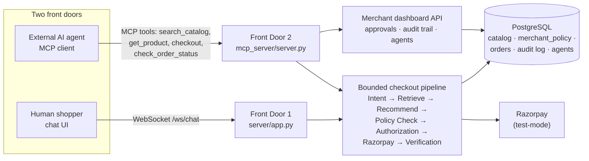

# Unified Agentic Commerce Platform

**Razorpay Hackathon — Track 01: AI Growth & Agentic Commerce**

One backend, one set of rules, two front doors — a human shopper chatting,
and an external AI agent transacting — both going through the exact same
catalog, policy engine, and checkout pipeline.

## What this is

Every money action a merchant exposes — to a human or to an AI buyer — flows
through one bounded pipeline:

```
Intent → Retrieve → Recommend → Policy Check → Authorization → Razorpay → Verification
```

Low-risk purchases complete autonomously. Anything over the merchant's own
threshold pauses for human approval. Every step is logged, so the merchant
sees an audit trail, not a black box. That's "the bar" this project is built
against: every money action explainable, bounded, and gated.

It grows revenue (real, explained upsells/cross-sells grounded in
co-purchase data) **and** makes the merchant transactable by an AI buyer
(policy engine + MCP layer) at the same time.

## Architecture

Two front doors, one pipeline, one database:



Both front doors call the same `pipeline/graph.py` (LangGraph) and read the
same `merchant_policy` row, so a policy change (a discount cap, an approval
threshold) governs both a human's chat purchase and an AI agent's
programmatic one identically.

## Live demo

| Page | URL |
|---|---|
| Shopper chat (Front Door 1) | https://agentic-commerce-platform-pi.vercel.app/ |
| Merchant dashboard (Front Door 2's dashboard API) | https://agentic-commerce-platform-pi.vercel.app/merchant |
| Chat backend + webhook receiver | https://agentic-commerce-backend.onrender.com |
| MCP server (Front Door 2) | https://agentic-commerce-mcp-okgk.onrender.com/mcp |

Merchant dashboard login (test-mode demo credentials, see
`db/seed_merchant_credentials.py`):

| Merchant | Email | Password |
|---|---|---|
| Shopfront Running Co. | `owner@shopfrontrunning.com` | `RunningCo#2026` |
| Roast & Ritual | `owner@roastandritual.com` | `RoastRitual#2026` |

Render's free tier sleeps when idle — the first request after a while can
take ~30-60s to wake the service up.

## Running locally

See **[RUNNING.md](RUNNING.md)** for the full setup: `.env` vars, one-time
DB setup, starting all three processes, and a smoke-check for each piece.

## What's built

- **Front Door 1 — conversational checkout.** A human shopper chats
  naturally; the agent retrieves products, recommends upsells/cross-sells
  with a stated reason grounded in real co-purchase data, confirms, then
  pays via Razorpay test-mode.
- **Front Door 2 — MCP layer for AI buyers.** The same catalog + checkout
  logic exposed as MCP tools (`search_catalog`, `get_product`, `checkout`,
  `check_order_status`, `compare_and_buy`), so an external AI agent — its
  own identity, budget, and permissions — can browse and buy
  programmatically with zero human typing.
- **The approval gate.** A merchant-configured `approval_required_above`
  threshold, checked by the same `authorization_node` for both front doors:
  under it, an order completes autonomously; over it, the pipeline pauses
  (`interrupt()`) until the merchant resolves it from the dashboard.
- **Multi-tenant.** Two seeded merchants (Shopfront Running Co., Roast &
  Ritual), each with its own catalog and its own `merchant_policy` row —
  same pipeline, independently configured thresholds.
- **Merchant dashboard's extra tabs**, beyond Stock/Approvals/Audit Trail:
  - **Incident Center** — real, computed-not-invented counts (auto-approved,
    merchant approvals, policy blocks, payment failures, unhandled crashes).
  - **AI Commerce Score** — 5 real dimensions of how "AI-ready" the merchant
    is.
  - **AI Command Center (Growth Suggestions)** — query-backed upsell/repeat-
    purchase suggestions, never a fabricated one.
  - **Agents** — platform-wide stats per buyer agent (orders, success rate,
    policy blocks, payment failures) plus aggregate spend totals by agent
    type.
- **One failure handled gracefully** — a forced Razorpay test-mode decline
  surfaces as `final_status: failed` with the real decline reason in the
  audit trail, not a crash (see `DECLINE_TEST.md`).

## Tech stack

Python, FastAPI, LangGraph, PostgreSQL (Supabase), pgvector-based hybrid
retrieval, React, WebSocket, Razorpay test-mode APIs, MCP, Groq — deployed
on Render (backend) and Vercel (frontend). See `project-brief.md` for the
full pitch and judged-criteria framing.
